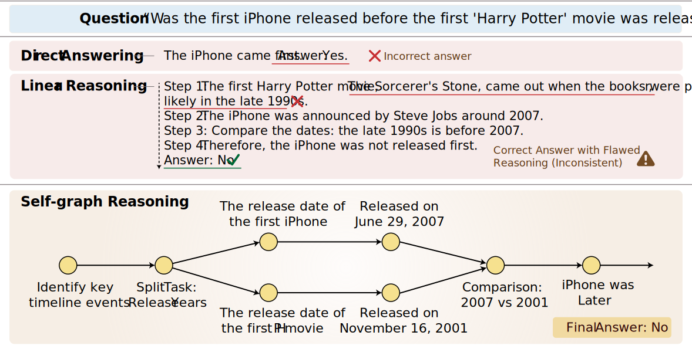

# SGR-Self-Graph-Reasoning
[]([https://arxiv.org/pdf/2502.16514](https://arxiv.org/abs/2601.03597))

Self-Graph Reasoning (SGR) is a graph-structured reasoning framework designed to enhance the reasoning capabilities of large language models (LLMs) for general-domain question answering. Unlike traditional linear reasoning paradigms, SGR enables LLMs to explicitly represent their reasoning processes as structured graphs prior to producing final answers. Rather than relying on externally provided graphs, SGR allows models to autonomously generate their own reasoning graphs, leading to improved logical consistency and interpretability.

In addition, we introduce a graph-structured reasoning dataset that merges multiple candidate reasoning graphs into refined structures, supporting effective supervised training of graph-based reasoning models.

<p align="center">
  
</p>

## Curated Benchmarks

We evaluate SGR on a curated benchmark collection located in `/data/datasets/benchmarks`, covering both general-domain and specialized-domain reasoning tasks.

### General Domain
- `LogiQA-test`
- `AIW`
- `AR-LSAT`

### Specialized Domain
- `MedQA`
- `MathQA`

Each data entry includes:
- `Question`: the input question
- `Label`: the ground-truth answer

## Training Data

We construct a graph-structured reasoning dataset consisting of 9,869 samples for training the SGR framework. The training data is located in `/data/datasets/training_data`. The dataset construction pipeline is provided in `/data/generate.sh`.

Each data entry includes:
- `Question`: the input question
- `Reasoning Path`: the graph-structured reasoning process generated for the question
- `Label`: the ground-truth answer

## Training

To start training, simply run:

```bash
bash run.sh
```

To train LLaMA-3.3-70B, set `llm_model_name to llama_70b`
You can further customize the training process by modifying the configuration file at `./src/config.py`, which includes key hyperparameters such as learning rate, batch size, and number of training epochs.

## Evaluation

To quickly evaluate the model, simply run:

   ```bash
   bash test.sh
   ```

## 📌 Citation

If you find our project helpful, please feel free to leave a ⭐ and cite our paper:

```bibtex
@article{chen2026chains,
  title={From Chains to Graphs: Self-Structured Reasoning for General-Domain LLMs},
  author={Chen, Yingjian and Liu, Haoran and Liu, Yinhong and Tong, Sherry T and Feng, Aosong and Lu, Jinghui and Zhang, Juntao and Iwasawa, Yusuke and Matsuo, Yutaka and Li, Irene},
  journal={arXiv preprint arXiv:2601.03597},
  year={2026}
}
